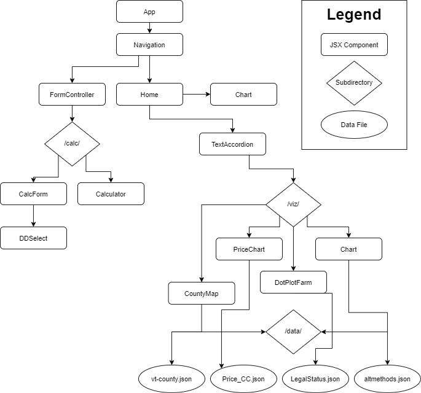

# VT/ME Climate Perceptions Platform

- [Abstract](#abstract)
- [About this application](#file-structure)
- [Sources](#sources)

# Abstract

This is an open-sourced React-JS application aimed to support small, medium and beginning farms in Vermont and other parts of New England. It should serve as a platform to educate farmers on existing tools and research on climate change. A part of this research is aimed at focusing on what issues farmers are facing, and how to best communicate solutions to these problems.

A provided calculator application will help to understand long-term investments as applicable to each farm on a case-by-case basis.

# File Structure

When possible, each component has been implemented as functional rather than Object-Oriented. This is to help in pushing the state up, as well as to allow more freedom in custom scripts per file.

All data has been loaded in as a .json file for standardization, and ease of use in working with D3.js.

Because D3 tries to modify the DOM directly, whereas React has a virtual DOM, it is difficult to render and modify the style of each chart. I believe this is because d3 and react render asynchronously, each containing its own style that is inconsistent in its priority. To work around this, a "callback function" of sorts was implemented in most of these visualizations. It will re-draw each chart on render, using a global variable "rerender".

# Sources

This work was supported by the United States Department of Agriculture (USDA) National Institute of Food and Agriculture (NIFA) Agriculture and Food Research Initiative (Niles, 2018-68006-28098). Title: “Assessing climate perceptions and developing adaptation resources for small, medium and beginning farmers”.

This application was also made possible largely by:

*[Reactjs](https://reactjs.org/)

*[D3.js](https://d3js.org/)

*[React-Bootstrap](https://react-bootstrap.github.io/)
